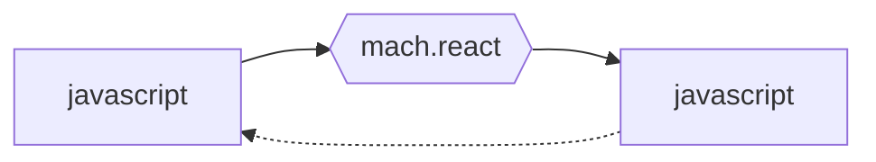

 HipHop: Reactive Web Programming
===============================================================================

<!-- github -->

<!-- /github -->

__Hiphop.js__ is JavaScript DSL for programming 
asynchronous applications. It executes on unmodified JavaScript
engines, let them run on server-side or client-side.

<!-- github -->
The documentation is available in two formats:

|     HTML generic documentation     | Markdown commit documentation     |
|------------------------------------|-----------------------------------|
| [HTML](http://hop.inria.fr/hiphop) | [markdown](./doc/README.md)       |
<!-- /github -->


Installation
------------

The HipHop.js installation depends on the JavaScript host 
(see Installation chapter). The easiest way to install it is when using 
`npm`. For that system, the installation is:

Until HipHop is released as an "official" npm package, use the
following to install it.

```shell
npm install https://www-sop.inria.fr/members/Manuel.Serrano/software/npmx/hiphop.tgz
```

When HipHop is officially released, the installation procedure is:

```shell
npm install @hop/hiphop
```

Getting started
---------------

In this introduction we merely show how to write and execute the "hello world"
HipHop.js program, assuming a Node.js/NPM installation. 

### Editing and compiling

We consider a program stored in a file named `hello.hh.js`, `.hh.js`
being the suffix of HipHop source files. This program waits for two
events `A` and `B` to be received. It then emits itself the event
`O`. Each time the `R` event is received, the program returns to its
initial state.

```hiphop
// hello.hh.js
import { ReactiveMachine } from "@hop/hiphop";

const HelloWorld = hiphop module() {
   in A; in B; in R;
   out O;
   do {
      fork {
         await (A.now);
      } par {
         await (B.now);
      }
      emit O();
   } every (R.now)
}
```

The `helloworld.hh.js` program uses the HipHop.js syntactic extension
`hiphop`. This tag has to be compiled down to plain JavaScript before
being executed. This compilation can be executed in two ways.

  1. **The standard way**: the file `hello.hh.js` is compiled in advance 
  with `hhc`, the HipHop compiler, and Node.js uses the result of this 
  compilation.
   
```shell
./node_module/@hop/hiphop/bin/hhc.mjs hello.hh.js -o hello.mjs
nodejs --enable-source-maps hello.mjs
```

  Using the Nodejs option `--enable-source-maps` ensures that if an error occurs
  while executing the program, Nodejs will prompt the error in the original
  HipHop source file instead of the file generated by `hhc`.
  
  2. **The easiest (but unportable) way **: just asks Nodejs to compile the 
  file on the fly for you. For that, simply invokes Node.js as follows:
  
```shell
nodejs --enable-source-maps --no-warnings --loader ./node_modules/@hop/hiphop/lib/hiphop-loader.mjs hello.hh.js
```

Alternatively, this can be decomposed using the shell variable environment
`NODE_OPTIONS`:

```shell
export NODE_OPTIONS="--enable-source-maps --no-warnings --loader ./node_modules/@hop/hiphop/lib/hiphop-loader.mjs"
nodejs hello.hh.js
```

> [!NOTE]
> In the future, the Nodejs' option `--loader` might be renamed. 
> Please check your setting for accomodating the future new name.
   
   With this method, the program `hello.hh.js` will be silently compiled
   into a `._hello.mjs` and `._hello.mjs.map` files. These are the files
   that Nodejs will use for executinon.
   


### Executing

Once compiled, in order to be executed, a HipHop program has be loaded
into a *reactive machine* and executed from within JavaScript. 
Actually the HipHop execution is interleaved with the JavaScript execution. 



Finally, to execute `helloworld.hh.js` from within a regular
JavaScript program, we create a machine and we proceed to *reactions*
(here 4 reactions are triggered).

```javascript
const m = new ReactiveMachine(HelloWorld);
m.addEventListener("O", e => console.log("got: ", e));
m.react({ A: 1 });
m.react({ B: 2 });
m.react({ R: true });
m.react({ A: 3, B: 4 });
```

> [!IMPORTANT]
> HipHop requires programs to use ECMAScript modules. They cannot 
> be used with CommonJS modules.
